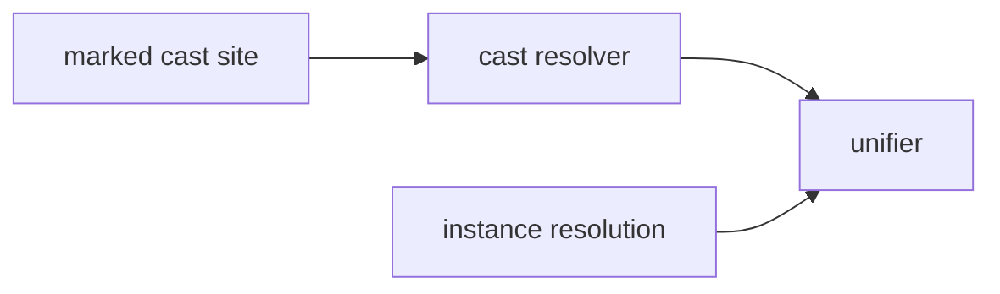

# The three-scheduler elaborator rule

**Proposed.
No elaborator, no metavariable, and no `cast` form exists in this tree.** What exists is the machinery this rule constrains and the posture it sharpens: the worklist solver as a separate, serializable machine ([[../typing-machine#The solver as a separate machine]]), the fuel-bounded, canonical-per-world instance resolution specified for the module layer ([[../../surface-language/proposed/modules#Implicit resolution]]), the certified level oracle ([[../../implementation#The trusted base]]), and a standing set of no-coercion records ([[../../surface-language#The expression grammar's deliberate exclusions]], [[../circuit-terms]], [[../../surface-language/directed-family#The derived coercion from Path to Flow, when it comes]]).

This document states one structural invariant every later elaborator design is specified against: **unification, canonical-instance resolution, and cast-sited coercion are three separate schedulers that never call each other implicitly, and every crossing between them is marked at a source site.**

## What is built, and what this document describes

**Built, and verified against the tree at write time.**

* **The solver is a separate machine from the recursive checker**, with its own inspectable state, and the two realizations are property-tested for step-for-step agreement on a control log — `gandr-core-checker`'s `machine` and `checker` modules ([[../typing-machine]]).
* **The level oracle decides the level judgements this rule's coercion resolver will consult**: levels are canonical finite joins over zero, successor, and join; ordering is by domination; lifts are written and never inferred; every decision returns checkable evidence — `kernel-strata` ([[../../implementation#The trusted base]]).
* **The corpus's instance-resolution specification already carries two of this rule's three invariants** — per-world canonicity (two candidates is a reported failure naming all of them, never a silent pick) and fuel as a solver parameter reported in diagnostics ([[../../surface-language/proposed/modules#Implicit resolution]]).
* **The corpus's coercion posture is already refusal-shaped at every layer this rule does not own**: no free-floating coercions in the surface grammar, no kernel coercion between the identity formers before the core-coincidence theorem, and the one open coercion question (a derived `Path → Flow` surface form) carried as the metatheory roadmap's meta-question-20.

**Designed, and not built.** The three-scheduler invariant itself, the `cast` form, the coercion preorder the resolver computes in, and the obligation-chain diagnostics.

## The scheduling argument

The motivation is a fact about the mathematics, and it is stated here because every future proposal to merge the schedulers must answer it first.

A coercion problem $\gamma : \alpha \triangleleft A$ cannot be solved by setting $\alpha \equiv A$ and $\gamma \equiv 1_A$, because that is not the most general solution — it is the _least_ general: $(A, 1_A)$ is the terminal object of the slice $\bold("Type") slash A$.
The two processes a combined solver would interleave have genuinely different invariants — unification must emit most general unifiers within a predictable fragment, while coercion resolution computes canonical maps in a preorder — and they interact, since solving a unification problem can unlock a postponed coercion and vice versa.
The moment a solver picks non-general solutions, the outcome depends on the order problems are solved in, and **order-sensitivity is user-visible unreliability even when every answer the solver gives is correct**.

The diagnosis is Amélia Liao's, reported in the Pterodactyl worklog [@sterling-2026-pterodactyl-worklog, tree 01JQ], with the conclusion Sterling draws from it: the problem cannot be solved inside the solver without changing the language, so the matter is put in front of the user.
This corpus records the consequence as a **ratified refutation of any combined unification–coercion solver, with no reopening delta** — the order-sensitivity is a property of the construction, not of an implementation, so no engineering effort removes it and none is invited to try.

## The rule

The elaborator treats the following as three distinct schedulers with disjoint contracts:

| scheduler           | what it solves                                                        | its reliability invariant                                                   |
| ------------------- | --------------------------------------------------------------------- | --------------------------------------------------------------------------- |
| the unifier         | implicit arguments, metavariables                                     | most general unifiers, within a predictable fragment only                   |
| instance resolution | canonical instances per world                                         | uniqueness by canonicity; fuel-bounded; the obligation chain in diagnostics |
| the `cast` resolver | level lifts, theory-refinement downcasts, any future derived coercion | canonical maps in the coercion preorder; user-sited, never inferred         |

### sched-rule-01

**Three schedulers, no implicit crossings.** Unification, instance resolution, and coercion resolution never call each other implicitly; every crossing between them is marked at a source site.

### sched-rule-02

**The unifier emits most general unifiers, in a predictable fragment only.** Outside the fragment it postpones — it never guesses.
Completeness within a well-defined fragment is the shadow property of reliability: a solver that sometimes finds non-general solutions is user-visible unreliability even when every answer it gives is correct.
The fragment of record is nested pattern unification — Miller's pattern fragment extended to record/Σ structure, respecting η-equivalence and definitional singletons natively [@kovacs-2023-nested-pattern-unification] — and its precise statement is the unifier specification's contract; this rule fixes only what the unifier may be asked for: no non-general solutions, and no coercion discharge, ever.

### sched-rule-03

**Instance resolution is canonical per world, and never fires a coercion.** Two candidates is a reported failure naming all of them, never a silent pick — the modular-implicits discipline [@white-bour-yallop-2015-modular-implicits] the module layer already specifies ([[../../surface-language/proposed/modules#Implicit resolution]]).
Search is fuel-bounded, and exhaustion is a diagnostic carrying the obligation chain.
Instance search **may** call the unifier — it must, to check candidates — and **may never** call the coercion resolver: a needed coercion at an instance boundary is a `cast` the user writes.
Implicit arguments stay scoped to type-level indices, never grades, because grade constraints are semiring equations pattern unification cannot express ([[../../metatheory#The kernel]], where this fence is recorded).

### sched-rule-04

**Coercion fires only at a marked site.** The coercion resolver runs at an explicit `cast` site, or inside an explicitly ascribed refinement, and nowhere else.
Everywhere else, a constraint that would need a coercion is an **error at the site**, reported as such — never a scheduling decision and never a silent insertion.

### sched-rule-05

**The call graph is one-directional.** The coercion resolver may call the unifier; instance resolution may call the unifier; and that is the whole graph.
Nothing calls the coercion resolver except a marked site, and the unifier calls nothing.

## The `cast` form

The ergonomics are the modular-explicits cost model [@vivien-remy-scherer-2026-modular-explicits]: **the shape is inferred, the act is explicit** — the user writes one keyword and never the types.

* **Typing.** In checking mode against an expected type $B$, `cast M` elaborates $M$ in inference mode at $A$, then asks the coercion resolver for the canonical map $\alpha : A triangle.small.r B$ in the coercion preorder; the elaborated term applies that map.
  The resolver's witness is elaboration evidence, checked and replayed like every other elaboration step — no opaque verdict enters the trusted base.
* **Derivation-survival.** The cast site is recorded in the derivation, so diagnostics can point at the conversion the user authorised rather than at a conversion the system invented.
  This is the fourth separation the rule adds to the module layer's three — visibility (world-scoped), search effort (fuel), usage (a grade) ([[../../surface-language/proposed/modules#Implicit resolution separates three things]]): **the act of conversion is sited**.
* **What the resolver computes in.** The coercion preorder's edges are elaboration metadata: level lifts inserted by the universe discipline, theory-refinement downcasts, and any future derived coercion — the derived `Path arrow Flow` form the metatheory roadmap's meta-question-20 wants _after_ the core-coincidence theorem is the standing example of the last.

## The three targeted designs, mapped

**Modular implicits** [@white-bour-yallop-2015-modular-implicits] is already the shape of gandr's instance discipline, and it is what makes the middle row of the scheduler table safe: type-directed resolution elaborating to ordinary first-class functor applications, deterministic under per-world canonicity.
The scheduling argument applies to it directly — an instance search that silently fired a coercion would reintroduce exactly the order-sensitivity — which is what [[#sched-rule-03]] forbids.

**Modular explicits** [@vivien-remy-scherer-2026-modular-explicits] supply the evidence that the explicit-act discipline is livable at scale: shape inference with an explicit act is precisely the `cast` form's cost model, and their elaboration of the explicit shorthand through ordinary mechanisms — rather than a side channel — is the template for cast sites surviving into the derivation.

**Polarity-scoped implicit arguments** [@liesnikov-binder-suberkrub-2025-polarity] are the design most at risk without the rule: implicit arguments at constructor and observation boundaries are exactly where an elaborator is tempted to fuse unification with wrap/unwrap conversions at a polarity boundary.
Under the rule, these implicits are solved by the unifier alone, and any conversion the boundary needs is a `cast`. gandr's polarity discipline helps rather than hurts here: introduction and elimination forms already do not silently convert, so a coercion crossing a polarity boundary is suspicious on independent grounds, and the `cast` site marks exactly that crossing.

## What the kernel never sees

The ratified boundaries this rule does not reopen, collected so the elaborator's contract states them in one place:

* **No kernel coercions, ever.** Any coercion is elaborator-side and cast-sited; the kernel receives the fully elaborated term with the conversion made explicit.
* **Kernel cumulativity stays refused.** Lifts are written, never inferred ([[../../implementation#The trusted base]]); the elaborator buys cumulativity's ergonomics by inserting explicit lifts at checked sites, cast-visible where [[#sched-rule-04]] wants the crossing marked.
* **No second hidden user-facing identity type.** The identity formers stay independent primitives with the comparison as the core-coincidence _theorem_ ([[../../surface-language/directed-family#The derived coercion from Path to Flow, when it comes]]); a derived coercion, once earned, is a `cast`-resolver edge like any other.
* **No coercion through positive types.** This is the same shape as the polarity discipline — introduction forms do not silently convert — and is machinery, not convention.

## The cells facet for declared coercions

Recorded as a **candidate mechanism, not part of this document's contract** — the contract is the rule, not the resolver's internals.

Declared coercions could plausibly be carried by gandr's rewriting-cell machinery rather than by a bespoke component: the coercion graph is a graph, the cell layer already tracks graph structure, and coherence checking over that graph is the same shape as completion — in the spirit of Rocq's declared coercions and of Sakaguchi's insert-and-close algorithm [@sakaguchi-2023-refinement-extension].
The connection is already visible in the corpus from the other side: the circuit-terms design carries the open question of whether a checked implicit coercion could be an inhabitant of an existing evidence type rather than new machinery ([[../circuit-terms]], its circuit-terms-question-13), carried there as a future direction with its hazards named.
This rule gives that question its scheduler slot if it is ever taken: whatever carries a declared coercion, it fires only at a marked site, per [[#sched-rule-04]].

## What this rule binds

Stated as forward constraints on the designs that consume it, so their specifications need no private context:

* **The unifier** may assume it is never asked for a non-general solution and never asked to discharge a coercion; its reliability contract is [[#sched-rule-02]]'s.
* **The theory layer's** refinement downcasts run under `cast` sites only; the labelled preorder that computes them is elaboration metadata with coherence checked at edge insertion.
* **Eliminator elaboration's** postponed constraints block the refinement step; no coercion escape hatch exists until a coercion layer does.
* **The display layer's** diagnostics can rely on cast sites being derivation records: every conversion a user sees was either authorised at a site or reported as an error at one.

## Open dispositions

* **The cast resolver's internal mechanism** — carried; the cells facet above is the candidate of record, and the contract here is the rule, not the resolver.
* **The coercion preorder's register** — carried to the theory layer's design, which owns the labelled preorder over theory names and its insert-time coherence checking.
* **The circuit-terms coercion question** (circuit-terms-question-13) — carried where it lives; this document records the scheduler slot it would occupy, and answers nothing about the evidence type.
* **The `cast` keyword's spelling and grammar slot** — parked; a surface-vocabulary decision for the declaration-forms pass, constrained only by the standing bracket-based posture.

## Source and confidence

Written against four sources, named because a change with no declared source set cannot be fidelity-reviewed.

1. The **design record for the absorption**: the Pterodactyl worklog's disentanglement tree [@sterling-2026-pterodactyl-worklog, tree 01JQ] and the ratified rulings that bind this document (no combined solver, no kernel coercions, no coercions through positive types, no second hidden identity type, no kernel change for the universe layer), restated here in full so the document stands alone.
2. **The tree**, for every as-built claim: `gandr-core-checker`'s `machine` and `checker` modules (the two realizations and their agreement testing) and `kernel-strata` (the level oracle's canonical joins and written-lifts discipline).
3. The **corpus documents that carry this design's premises** — the typing machine's solver separation, the module layer's implicit-resolution specification, the trusted-base record, the directed-family coercion posture, and the circuit-terms coercion question — which this document links rather than restates.
4. The **published literature**: modular implicits [@white-bour-yallop-2015-modular-implicits], modular explicits [@vivien-remy-scherer-2026-modular-explicits], the polarity implicits account [@liesnikov-binder-suberkrub-2025-polarity], and Sakaguchi's thesis [@sakaguchi-2023-refinement-extension] for the insert-and-close precedent.

**Confidence, by class.**

* **High** — the rule itself, the scheduling argument, and the four kernel boundaries, which restate ratified rulings rather than derive new ones.
* **High** — the as-built statements, each verified against the named module or document at write time.
* **Medium** — the modular-explicits ergonomics mapping, read from the paper's account rather than from experience with the system.
* **Marked at the claim** — the cells facet, recorded as a candidate mechanism with its contract explicitly out of scope.
