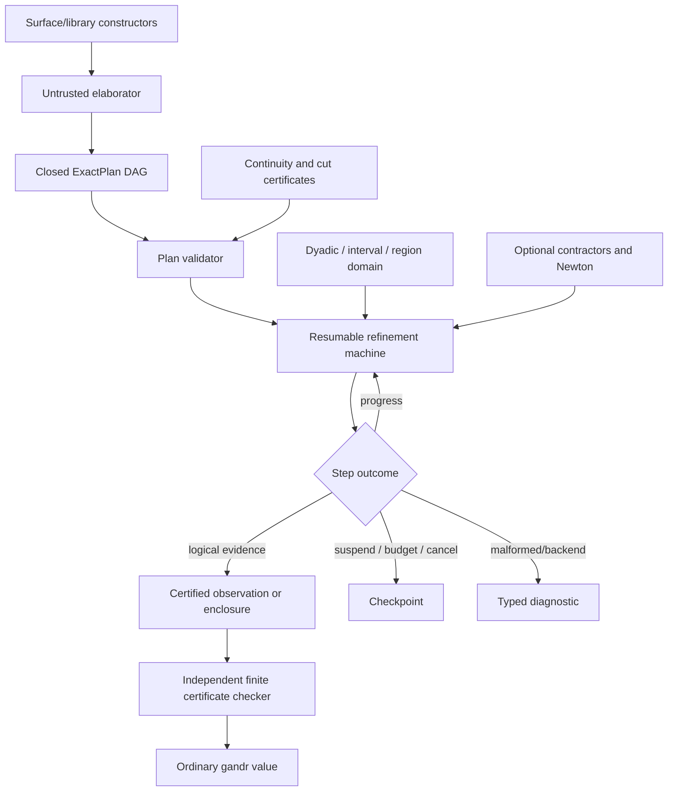

# Exact reals and synthetic topology

The adopted lateral track for exact real-number computation, and the progressive internalization of Abstract Stone Duality (ASD) and synthetic topology that it carries.

* Status: **adopted direction, nothing built**, firewalled as a lateral stress-test track — never a blocker on the minimal-kernel path, and never a prerequisite for it.
* The design record is the exact-reals implementation proposal (the engineering architecture) and its metatheory contact analysis (the equipment reading, the temporal reading, and the `ua_topo` statement shape); this document carries both, with their open items dispositioned where a reader meets them.
* The implementation track's phase tail names this line as "stone duality"; the surface vocabulary decision of record is that the semidecision type is named **Sier** (Sierpiński), never spelled as a Σ, and Sierpiński truth is never encoded as a boolean or optional boolean.
* Code sketches below are quoted from the design record: **Rust-shaped pseudocode, not a commitment to names**.

## The semantic contract

The public contract is a restricted ASD fragment, stated as five commitments.

* **Sierpiński-valued semidecisions, never booleans.** A one-sided semidecision may:
  + emit finite positive evidence;
  + remain pending;
  + suspend at a checkpoint;
  + exhaust a budget;
  + be cancelled;
  + report a malformed-plan or backend diagnostic.

  Only the first establishes truth; **none of the operational outcomes establishes falsehood** — negative evidence requires a separately certified co-semidecision or a finite bilateral proof.
  A first-class open classifier is never an unrestricted host closure: it is a reified term assembled from approved continuous primitives, or a map paired with a checkable continuity certificate.
* **Lower and upper reals, paired as certified Dedekind cuts.** `LowerReal` and `UpperReal` are independently meaningful one-sided objects; a `RealCut` pairs them with the cut obligations:
  + roundedness, both directions (forward and backward per side);
  + inhabited and bounded sides;
  + **disjointness**: $delta(d) and upsilon(u) arrow.double d < u$;
  + **locatedness**: $d < u arrow.double delta(d) or upsilon(u)$.

  A cut is not "just a shrinking interval": numeric enclosures are runtime approximants to the cut, and strict inequalities and apartness may be semidecidable while **total real equality is not supplied**.
* **Open formulae with bounded quantification.**
  + bounded existential quantification over **overt** domains;
  + bounded universal quantification over **compact** domains;
  + elaboration of each demands its modality certificate — never arbitrary sampling or point enumeration.

  Generic overtness supplies positive possibility evidence, not a point extractor; a point is the separate, stronger `SearchableOvert` structure, which a restricted interval solver may provide without making it an overtness law.
* **Interval and region approximants as runtime representations only**, with explicit orientation (proper versus dual/Kaucher) and totalized indeterminate operations.
* **An explicit, resumable refinement machine** emitting finite witnesses and certificates, with **a small independent checker** for those certificates — initially in the exact-real library; promotion to generic kernel replay is an open decision requiring an evidence format compatible with the minimal kernel boundary.

Explicitly not the design:

* a line-for-line port of the Marshall prototype [@bauer-marshall] — an executable design fossil whose semantic decomposition is the lesson and whose implementation discipline (substitution duplication, recursive host control, assertions, unfinished Newton, no memoization) is the anti-pattern;
* a Cauchy-stream-only library — it obscures the open-predicate logic, the compact/overt quantification, and the witness structure;
* a new primitive `Real` former in the frozen core — it violates the minimal-kernel focus and couples the kernel to arithmetic search.

None of interval arithmetic, search, Newton acceleration, topological axioms, or real equality ever enters kernel conversion.

## Why gandr fits, and the four axes that must not collapse

Four independent notions must never be conflated:

| axis                     | content                                                                                       |
| ------------------------ | --------------------------------------------------------------------------------------------- |
| **ASD lattice polarity** | overt/join/existential versus compact/meet/universal                                          |
| **CBPV sort**            | values are descriptions and evidence; computations perform observation and refinement         |
| **sequent placement**    | producer versus consumer, to be justified by typed focusing rules                             |
| **runtime outcome**      | progress, suspension, cancellation, budget exhaustion, diagnostics — not logical truth values |

The CBPV placement is explicit:

| exact-real notion                                            | CBPV role                                          |
| ------------------------------------------------------------ | -------------------------------------------------- |
| `ExactPlan`, `OpenPlan`, `RealCut`, basis/cover descriptions | value                                              |
| `RefinementState`, checkpoint, certificates                  | value                                              |
| plan construction from pure constructors                     | value construction                                 |
| validation                                                   | computation returning validated data or diagnostic |
| open observation, enclosure, comparison                      | computation                                        |
| bounded `exists`/`forall`                                    | computation                                        |
| one refinement step or replay step                           | computation                                        |
| optional native accelerator                                  | capability-scoped effect                           |
| tracing, cancellation, checkpoint persistence                | effects around computation                         |

A higher-order open predicate passed as a value is thunked explicitly; no implicit value/computation coercion is introduced for ASD.

**Static grades and dynamic work are separate.** Static thunk grades control duplication (a linear plan/session handle prevents accidental duplicated search; a reusable pure plan may be ω-graded); dynamic refinement work is explicit run data:

```text
ExactWork {
  dyadic_ops_by_bit_width,
  interval_nodes,
  lower_upper_evals,
  splits,
  contractor_calls,
  newton_calls,
  queue_pops,
  cache_hits,
  certificate_nodes,
  checkpoint_bytes,
}
```

Precision, runtime fuel, static usage, and logical truth are four independent concepts; a future graded-computation or cost-effect design may relate some of them, but that is designed direction, not current behavior.

The sequent-machine attraction is real but marked: overt existential/join obligations suggest positive focused branching and compact universal/meet obligations suggest negative focused coverage — an inference in the engineering source whose **semantic half is grounded by the equipment reading below**, and whose operational half (typed L-machine preservation rules) remains to be proved.
Exact-real work must not become a prerequisite for the minimal-kernel/bootstrap path.

## The architecture

**A reified plan language plus a resumable, certificate-producing machine.**



### One crate first

Avoid premature crate proliferation; the trust split is visible in the module boundaries:

```text
crates/gandr-exact/
  dyadic.rs       canonical dyadics and primitive exact comparisons
  interval.rs     explicitly oriented NumericInterval
  region.rs       normalized NumericRegion
  ir.rs           scoped, closed ExactPlan/OpenPlan/domain DAG
  validate.rs     untrusted plan/schema/checkpoint validation only
  approx.rs       dual positive/negative abstract interpretation
  machine.rs      obligations, continuations, and one-step transition
  schedule.rs     deterministic dovetailing work queue
  cache.rs        exact-key checked-result cache
  certificate.rs  first-order certificates and semantic replay checker
  strategy.rs     baseline split plus optional contractors/Newton
  cost.rs         dynamic work counters and bounded-work quanta
```

* The crate does not depend on the gandr parser or frozen core; an adapter in the runtime/shell layer translates between gandr values and the closed plan format.
* **The bignum substrate is `num-bigint`**, vetted for this purpose and shared with the arbitrary-precision `Int`/`Nat` item rather than chosen separately here — the two land behind the same feature and must agree on their integer carrier.
  The Marshall prototype is a design fossil to read, never a port target; the distinction is recorded here because a substrate choice left implicit is the kind that gets re-litigated when the tail phase starts.
* A separate replay-checker crate is split only when the certificate grammar is stable and independently useful.
* `validate.rs` and `certificate.rs` have deliberately different authority:
  + `validate.rs` rejects malformed untrusted plans, checkpoints, and certificate encodings;
  + `certificate.rs` establishes a typed semantic judgment by replaying canonical primitive rules;
  + **no serialized value is trusted because it was once called validated** — every value crossing the gandr/native boundary is revalidated.

### The scoped core data model

```rust
enum Endpoint {
    NegInf,
    Finite(Dyadic),
    PosInf,
}

struct NumericInterval {
    left: Endpoint,
    right: Endpoint,
    orientation: Orientation, // proper or dual/back-to-front
    closure: EndpointClosure,
}

struct NumericRegion {
    pieces: Vec<Segment>, // canonical, ordered, disjoint
}

enum RealPlan {
    BoundVar { index: DeBruijnIndex },
    Dyadic(Dyadic),
    Add(RealPlanId, RealPlanId),
    Sub(RealPlanId, RealPlanId),
    Mul(RealPlanId, RealPlanId),
    Div { lhs: RealPlanId, rhs: RealPlanId, nonzero: CertId },
    PowNat(RealPlanId, u32),
    Cut(CutPlanId),
}

enum OpenPlan {
    Top,
    Bottom,
    StrictLt(RealPlanId, RealPlanId),
    And(OpenPlanId, OpenPlanId),
    Or(OpenPlanId, OpenPlanId),
    Exists {
        domain: DomainPlanId,
        body: OpenPlanId, // BoundVar(0) is in scope
        evidence: OvertEvidenceId,
        dual: Option<CompactEvidenceId>,
    },
    Forall {
        domain: DomainPlanId,
        body: OpenPlanId, // BoundVar(0) is in scope
        evidence: CompactEvidenceId,
        dual: Option<OvertEvidenceId>,
    },
}

enum DomainPlan {
    Interval {
        hull: NumericInterval,
        overt: Option<OvertEvidenceId>,
        compact: Option<CompactEvidenceId>,
    },
    Product {
        left: DomainPlanId,
        right: DomainPlanId,
        evidence: ProductEvidenceId,
    },
    CertifiedSubdomain {
        parent: DomainPlanId,
        classifier: OpenPlanId,
        evidence: SubdomainEvidenceId,
    },
}

struct CutPlan {
    hull: NumericInterval,
    lower: OpenPlanId, // BoundVar(0) is in scope
    upper: OpenPlanId, // BoundVar(0) is in scope
    laws: CutCertificateId,
}
```

The binding convention is substitution-free:

* entering `Exists`, `Forall`, or `Cut` pushes one real-valued interval cell;
* `BoundVar(0)` names the innermost cell and larger indices walk outward;
* the validator rejects escaping indices and sort mismatches;
* environments are canonical slot vectors, not maps keyed by source names;
* alpha-equivalent plans serialize and hash identically;
* shadowing affects only de Bruijn depth, never source-name identity.

The deliberate MVP restrictions:

* closed, first-order plans after de Bruijn closure checking;
* explicit domain evidence on quantifiers;
* no arbitrary closures, FFI calls, effects, or user recursion inside a plan;
* arithmetic limited to operations with validated interval extensions;
* elementary functions added only with a sound enclosure rule and derivative/contractor evidence.

These are what make **continuity structural, plan identity alpha-stable, certificate replay finite, and caching auditable**.

### Validation

A total pass.
For plans it checks:

* node references, de Bruijn scope, and real/open/domain sorts;
* closedness and finite DAG acyclicity;
* interval endpoint, closure, and orientation invariants;
* quantifier/domain compatibility;
* required overt evidence for `Exists` and compact evidence for `Forall`;
* optional dual evidence before a negative quantifier conclusion is enabled;
* division and elementary-operation side conditions;
* cut obligation references;
* strategy/capability requests;
* canonical encoding and size/depth quotas.

For checkpoints and cache artifacts it additionally checks:

* plan, rule-set, backend, strategy, and serializer versions;
* environment shape and canonical interval cells;
* branch lineage and continuation references;
* dependency and capability footprints;
* queue invariants, cursor/round metadata, and work counters;
* cache-key/value consistency;
* certificate schema before semantic replay.

Invalid input yields a typed `PlanError` or `CheckpointError`; it never constructs `ValidatedPlan` or `RefinementState`.

### Dual approximation judgments

Never a boolean from abstract interpretation:

```rust
enum PositiveApprox {
    ProvenTrue(TrueCert),
    Unknown,
}

enum NegativeApprox {
    ProvenFalse(FalseCert),
    Unknown,
}

struct BilateralApprox {
    positive: PositiveApprox,
    negative: NegativeApprox,
    residual: NumericRegion,
}
```

* The two channels are sound separately; a region left undecided by either remains unknown.
* Contradictory certificates are rejected by semantic replay; neither channel has precedence.
* The primary observations:
  + `enclose : RealPlan × RequestedPrecision -> Enclosure + containment certificate` for exact values;
  + a one-sided semidecision for predicates, or a bilateral proof when the plan carries the additional dual-domain evidence.
* `Exists` proves positive truth from an overt witness; it proves falsehood only through its optional compact dual and a certified cover.
* `Forall` proves positive truth from compact coverage; it proves falsehood from an overt counterexample when the optional dual is present.

### Obligations, continuations, and outcomes

```rust
struct Obligation {
    id: ObligationId,
    kind: ObligationKind,
    continuation: ContinuationId,
    branch: BranchPath,
    environment: EnvId,
    local_precision: DirectedPrecision,
    assumptions: AssumptionSetId,
    domain_evidence: DomainEvidenceId,
    dependencies: DependencyFootprint,
    scheduler: SchedulerMeta,
}

enum ObligationKind {
    Observe { open: OpenPlanId, pole: Pole },
    Enclose { real: RealPlanId, target: PrecisionPolicy },
    RefineCut { cut: CutPlanId, target: PrecisionPolicy },
    SplitDomain { domain: DomainPlanId, variable: EnvSlot },
    RunContractor { node: PlanNodeId, contractor: ContractorId },
    ReplayCertificate { certificate: CertificateId },
}

enum Continuation {
    Root,
    AndPositiveBoth { left: Slot, right: Slot },
    AndNegativeEither,
    OrPositiveEither,
    OrNegativeBoth { left: Slot, right: Slot },
    ExistsPositiveAny { witness_domain: DomainPlanId },
    ExistsNegativeCover { compact: CompactEvidenceId },
    ForallPositiveCover { compact: CompactEvidenceId },
    ForallNegativeAny { overt: OvertEvidenceId },
    CutLowerUpper { cut: CutPlanId },
    EnclosureChildren { parent: NumericInterval },
}

struct RefinementState {
    plan: Arc<ValidatedPlan>,
    frontier: DovetailQueue<Obligation>,
    continuations: Arena<Continuation>,
    environments: Arena<CanonicalEnv>,
    cache: CheckedApproxCache,
    target: PrecisionPolicy,
    strategy: StrategyPolicy,
    dynamic_work: ExactWork,
    replay: ReplayBuilder,
}
```

Parent completion is explicit:

| form             | positive conclusion                                                         | negative conclusion                     |
| ---------------- | --------------------------------------------------------------------------- | --------------------------------------- |
| strict `<`       | certified separated endpoint bounds                                         | certified reverse/non-overlap bound     |
| `And`            | both children true                                                          | either child false                      |
| `Or`             | either child true                                                           | both children false                     |
| overt `Exists`   | one certified positive branch; a point only with `SearchableOvert` evidence | only a certified compact-dual cover     |
| compact `Forall` | a certified finite/refinement cover                                         | one certified overt-dual counterexample |
| cut              | lower/upper obligation named by the observation                             | only the corresponding bilateral rule   |
| enclosure        | all child intervals covered and width target met                            | not a logical pole; continue or suspend |

Real and domain constructors have equally explicit transitions:

| constructor           | transition and checked evidence                                                                                   |
| --------------------- | ----------------------------------------------------------------------------------------------------------------- |
| `BoundVar(i)`         | load canonical environment cell `i`; reject out-of-scope/sort mismatch during validation                          |
| `Dyadic(q)`           | emit the singleton proper interval `[q,q]` with canonical dyadic evidence                                         |
| `Add` / `Sub` / `Mul` | enqueue both child enclosures, apply the directed primitive rule, attach inclusion evidence                       |
| `Div`                 | replay the nonzero/domain certificate; if zero remains possible, split or stay unknown rather than apply division |
| `PowNat`              | enqueue the base, use exponentiation by squaring with checked exponent arithmetic, emit inclusion evidence        |
| `Cut`                 | invoke the certified cut-elimination/refinement continuation                                                      |
| interval domain       | emit the validated hull and its overt/compact evidence                                                            |
| product domain        | allocate one environment cell per component and compose the named product evidence                                |
| certified subdomain   | observe the classifier and retain only regions justified by its certificate; unresolved regions remain live       |

Operational stops retain resumable state:

```rust
enum StepOutcome {
    Progress(ProgressDelta),
    ProvenTrue(TrueCert),
    ProvenFalse(FalseCert),
    Enclosed(EnclosureCert),
    Suspended { reason: SuspendReason, checkpoint: Checkpoint },
    NeedsCapability { capability: CapabilityId, checkpoint: Checkpoint },
    BudgetExhausted { checkpoint: Checkpoint },
    Cancelled { receipt: CancellationReceipt, checkpoint: Checkpoint },
    Malformed(PlanError),
    BackendFault {
        checkpoint: Checkpoint,
        diagnostic: ExactError,
        provenance: BackendProvenance,
    },
}
```

A backend fault never commits an uncertified partial pruning: policy may retry, use a safe baseline strategy, or terminate with the checkpoint; it cannot reinterpret the fault as a logical result.

### The bounded one-step transition

A public machine step consumes a `WorkQuantum`, not an unbounded traversal:

1. pop the next obligation from the deterministic dovetail queue;
2. form the complete cache key for its exact judgment;
3. replay a cached checked result, or push a bounded traversal frame;
4. execute at most the quantum's allowed primitive work;
5. yield inside DAG traversal, large integer operations, region normalization, contractors, serialization, and certificate replay;
6. when a child concludes, apply its typed parent continuation;
7. when approximation is unknown, try an enabled contractor within its own quantum;
8. if no certified contractor progress is available, choose a split variable and point;
9. create children with canonical branch paths and deterministic order;
10. update dependencies, work counters, queue round/cursor, and replay builder;
11. return one `StepOutcome`.

Primitive work is metered by operation class — limb operations, visited DAG nodes, normalized region pieces, certificate nodes — and production implementations also check cancellation between bounded chunks of big-integer and serialization work.

### Deterministic fairness

The baseline scheduler is deterministic round-robin dovetailing, not weighted priority:

* every continuously live obligation receives a bounded quantum infinitely often in an unbounded run, subject only to explicit suspension or cancellation;
* newly generated children join the next queue generation, so they cannot permanently displace older work;
* queue order is canonical by generation, parent branch path, and child ordinal;
* round, cursor, generation, and branch age are serialized in checkpoints;
* cancellation and resume preserve the next obligation exactly;
* weighted heuristics may later reorder work only if they refine this minimum-service invariant — they are optimization policy, not the baseline semantics.

Fairness tests must include:

* an overt witness behind a divergent sibling;
* compact coverage with a divergent sibling;
* a universal counterexample behind a divergent sibling;
* nested dynamically generated branches;
* checkpoint/resume from the middle of a round.

### Sound caching

The first release caches only **checked** approximants and certificates under an exact key:

```rust
struct ApproxCacheKey {
    node: AlphaStableNodeId,
    environment: CanonicalEnvDigest,
    observation: ObservationKind,
    pole: Pole,
    requested_precision: DirectedPrecision,
    rounding_mode: RoundingMode,
    domain_evidence: DomainEvidenceDigest,
    interval_shape: OrientationClosureDigest,
    assumptions: AssumptionDigest,
    branch_lineage: BranchPath,
    plan_version: PlanVersion,
    backend_version: BackendVersion,
    strategy_version: StrategyVersion,
    rule_set_version: RuleSetVersion,
    serializer_version: SerializerVersion,
    dependencies: DependencyDigest,
}
```

* The exact-key baseline deliberately gives up some reuse for a simple proof obligation.
* It never caches timeouts, cancellation, heuristic guesses, unvalidated accelerator hints, or unchecked partial pruning.
* Later monotone precision reuse requires a separate theorem and explicit direction:
  + a tighter checked enclosure answers a weaker request only when containment and target ordering are replayed;
  + positive/negative evidence is reused only under the environment/domain weakening rules the certificate names;
  + eviction changes performance only;
  + stale versions or dependencies are rejected, not repaired.
* Checkpoint restoration verifies every referenced cache entry; tests compare cached and uncached judgments, eviction patterns, and replay after serialization.

### First-order certificates and trust

Certificates are a versioned first-order DAG:

```rust
struct Certificate {
    format: CertificateFormatVersion,
    rule_set: RuleSetVersion,
    plan: PlanDigest,
    root: CertificateNodeId,
    nodes: Vec<CertificateNode>,
    dependencies: DependencyFootprint,
}

struct CertificateNode {
    rule: RuleId,
    conclusion: Judgment,
    premises: Vec<CertificateNodeId>,
    evidence: RuleEvidence,
    branch: BranchPath,
}

enum Judgment {
    PositiveOpen { open: OpenPlanId, environment: EnvDigest },
    NegativeOpen { open: OpenPlanId, environment: EnvDigest },
    Encloses {
        real: RealPlanId,
        environment: EnvDigest,
        interval: CanonicalInterval,
        precision: DirectedPrecision,
    },
    Covers { parent: CanonicalRegion, children: Vec<CanonicalRegion> },
    CutLaw { cut: CutPlanId, law: CutLaw },
    MapContinuous { map: ReifiedMapId, preimage: OpenTransformerId },
}

enum RuleEvidence {
    DyadicComparison { lhs: Dyadic, relation: Relation, rhs: Dyadic },
    DirectedArithmetic { op: PrimitiveOp, inputs: Vec<Dyadic>, output: Dyadic, rounding: RoundingFact },
    IntervalInclusion { inner: CanonicalInterval, outer: CanonicalInterval },
    RegionPartition { parent: CanonicalRegion, children: Vec<CanonicalRegion> },
    OvertPositive { domain: DomainPlanId, observation: OpenPlanId, search_witness: Option<WitnessCode> },
    CompactCover { domain: DomainPlanId, pieces: Vec<CertificateNodeId> },
    CutUse { law: CutLaw, operands: Vec<Dyadic>, derivation: CutLawDerivationId },
    ContinuityUse { law: ContinuityLaw, constructor: ReifiedMapConstructor },
    ContractorInclusion {
        derivative: DerivativeEvidence,
        proposed: CanonicalRegion,
        retained: CanonicalRegion,
    },
}
```

* `search_witness` is present only when the validated domain carries `SearchableOvert` evidence; generic `Overt` yields the positive modal judgment without claiming a point.
* Every conclusion carries expression and capture-free environment identity; nodes carry canonical endpoint orientation/closure through their evidence, precision and rounding facts, domain/cut evidence, branch/region lineage, and child hashes in the canonical serialization.
* The top-level envelope records backend provenance for diagnostics; backend identity never substitutes for a rule.

Semantic replay:

* validates the schema and quotas first;
* checks premise indices and acyclicity;
* uses only canonical dyadic comparison, checked integer arithmetic, and primitive inequalities;
* **does not call the producer's interval/region or contractor implementation**;
* reconstructs each typed conclusion from its premises and rule evidence;
* rejects stale plan, rule-set, serializer, dependency, and capability versions;
* returns `Checked`, typed rejection, or `CheckerBudgetExhausted` — never a panic or a logical falsehood.

The checker has its own node/byte/limb budget and cancellation points; a producer is untrusted even if it lives in the same crate — only successful replay establishes the observation.

### Cut certification and elimination

`CutCertificateId` points to checked derivation content, not a bag of references; a general reified cut certificate contains eight judgments:

```rust
struct CutCertificate {
    lower_rounded_forward: CertificateNodeId,
    lower_rounded_backward: CertificateNodeId,
    upper_rounded_forward: CertificateNodeId,
    upper_rounded_backward: CertificateNodeId,
    lower_inhabited: CertificateNodeId,
    upper_inhabited: CertificateNodeId,
    disjoint: CertificateNodeId,
    located: CertificateNodeId,
}
```

* The paired forward/backward roundedness nodes prove each source equivalence, not only monotonicity.
* `disjoint` proves $delta(d) and upsilon(u) arrow.double d < u$; `located` proves $d < u arrow.double delta(d) or upsilon(u)$.
* The inhabited nodes carry finite rational/dyadic witnesses for each side.
* Each derivation is scoped over the cut predicates and replayed before `RealPlan::Cut` becomes valid.
* The first release accepts only validator-known cut constructors with checker-known theorem schemas — the monotone-root `sqrt 2` schema first; general user cuts wait until the ordinary evidence surface can provide all eight reified derivations.

Observation through a cut uses the cut-elimination bridge of the exact-computation line [@bauer-2008-dedekind-reals].
For a reified open $phi$ whose binders are disjoint from the cut predicates:

```text
phi(cut(x, delta, upsilon))
  <=>
exists d,u.
  delta(d) and d < u and upsilon(u)
  and forall x in [d,u]. phi(x)
```

* In the executable fragment, $d$ and $u$ are represented rational/dyadic endpoint witnesses, the endpoint pair has overt/searchable evidence, and $[d,u]$ carries the compact evidence the bounded universal requires.
* The certificate rule records:
  + the two endpoint witnesses and their exact comparison;
  + positive certificates for $delta(d)$ and $upsilon(u)$;
  + the compact interval certificate;
  + the certified finite/refinement cover for $phi$;
  + the capture-avoidance/scoping check;
  + the resulting `PositiveOpen` or enclosure judgment.
* An equivalent specialized refinement rule is acceptable only if it emits this same finite evidence.
* Forged law ids, missing side conditions, capture, and a cut-elimination certificate with a dropped interval branch are mandatory negative tests.

### Security and reliability boundaries

Exact-real computation is CPU- and memory-adversarial by nature; a plan is untrusted input.
Required controls:

* bounded plan/node/certificate sizes;
* checked arithmetic on sizes, exponents, and counters;
* capability-gated native accelerators;
* cancellation and checkpoint quotas;
* deterministic resource accounting;
* no host stack recursion proportional to search depth;
* no unchecked indexing/slicing or panics in production paths;
* versioned serialization;
* cache partitioning by tenant/session if exposed beyond local use;
* diagnostic separation between malformed input, backend failure, resource outcome, and logical evidence;
* a bounded checker even against proof-producing accelerators — a huge certificate is a denial-of-service vector, so checker work is bounded and reported.

## The staged plan and its gates

| stage                                                                                | content                                                                                                                                                                                                                                                                                                               | gate (summary)                                                                                                                                                                                                                                                                                                                                                                                                 |
| ------------------------------------------------------------------------------------ | --------------------------------------------------------------------------------------------------------------------------------------------------------------------------------------------------------------------------------------------------------------------------------------------------------------------- | -------------------------------------------------------------------------------------------------------------------------------------------------------------------------------------------------------------------------------------------------------------------------------------------------------------------------------------------------------------------------------------------------------------- |
| **A** — semantic contract, scoped IR, primitive checker                              | canonical dyadics; endpoints/oriented intervals/regions; the scoped plan/domain DAG with canonical serialization; total validation; dual approximation for constants, arithmetic, strict inequality, finite meet/join; versioned certificate ADT with primitive replay; validator-known cut schemas                   | no panics or partial APIs; escaped/wrong-sort binders and mismatched domain evidence rejected; forged cut laws and malformed certificate DAGs rejected; differential against a slow rational oracle; outward-rounding and enclosure properties hold; **no change to the frozen core**                                                                                                                          |
| **B** — the complete bounded-fragment machine                                        | typed obligations and continuations for every supported node; deterministic dovetailing with bounded quanta; checkpoints, work accounting, cancellation; cut elimination; bounded overt `exists` and compact `forall` with optional bilateral dual evidence; exact-key checked-result cache; complete semantic replay | every constructor covered or rejected at validation; suspension/cancellation/budget/backend fault distinct from false; replay validates after canonical serialization; divergent-sibling fairness cases pass (existential witness, universal coverage, counterexample); checker/bignum/region/serialization work yields within quanta; stack depth independent of search depth; cached and uncached runs agree |
| **C** — gandr adapter, corpus, first baseline release — **the first useful release** | capability-scoped native/host adapter; opaque or serialized plan values, always revalidated; `enclose`, strict comparison, `step`, `resume`, work-report operations; model corpus examples and pathological goldens; benchmark and quota profiles                                                                     | every validated plan progresses, certifies, or stops typed; end-to-end `sqrt 2`, overt existential, compact universal through the ordinary driver; forged cut-law, binder-capture, modality-mismatch, certificate-corruption cases fail; malformed data and capability denial produce defined diagnostics; **no ASD-specific core syntax or kernel reduction**                                                 |
| **D1** — semantics-preserving local optimization                                     | hash-consed DAG and persistent environments; shared bilateral traversal; exact-key cache with quotas/eviction; adaptive local precision; fairness-preserving split selection; expanded benchmarks                                                                                                                     | each optimization differentially equivalent to the uncached baseline; cache invalidation and checkpoint restoration tested; precision reuse disabled until its monotonic theorem lands                                                                                                                                                                                                                         |
| **D2** — optional accelerators                                                       | primitive contractors; forward automatic differentiation; one-dimensional interval Newton; optional native screening                                                                                                                                                                                                  | every accelerator result reduces to primitive certificate rules or is revalidated by the baseline; safe decline/fallback on unsupported/nonsmooth cases; cancellation never commits partial pruning; no accelerator required for stage-C compatibility                                                                                                                                                         |
| **E** — the ASD library surface                                                      | `Sier`/semidecision; `Open` and the checked `ContinuousMap` derivation; `LowerReal`/`UpperReal`/`RealCut`; `Overt`/`Compact`/`SearchableOvert`; certified basic interval space and continuous arithmetic maps; general reified cut derivations                                                                        | arbitrary functions cannot masquerade as continuous; modal, continuity, and all eight cut laws are explicit checked obligations; generic overtness never promises point extraction; exact syntax passes the ordinary parser/elaborator boundary without core special cases                                                                                                                                     |
| **F** — bases, covers, locales, subspaces                                            | basic-open generators; top coverage and finite-meet refinement; represented admissible joins; sound cover relation; interpretation/completion into opens; locale maps as inverse-image maps; open/closed and compact/overt subspaces                                                                                  | every operation has a checkable semantic law; Phoa's law proved in the sealed model or carried as certified structure; no claim of arbitrary executable complete frames; local compactness gates function spaces; **library/certificate judgments, never kernel conversion**                                                                                                                                   |
| **G** — optional reflected topology universe                                         | `SpaceDesc`/`OpenCode`/`BasisCode`/`CoverCode`/`LocaleIsoCode`/`HomeomorphismCode`; canonical serialization and equality of finite codes; generated validators; replay over topology descriptions; generic continuous-map derivation; backend migration certificates                                                  | depends on levitation stage 1, settled description/certificate formats, the reflection face, and the invertible/directed boundary (already discharged — see below); any `ua_topo` is a theorem over a reflected stratum, **never an axiom or conversion rule**; numeric intervals remain unrelated to paths                                                                                                    |

The first-release acceptance criteria, in full:

* supports every well-formed plan in the declared first-order bounded interval fragment and rejects every out-of-fragment constructor during validation;
* constructs `sqrt 2` through the registered cut schema and returns certified enclosures at requested dyadic precision;
* implements arithmetic and strict comparison on scoped reified plans;
* supports overt bounded existential and compact bounded universal judgments with required modality evidence, not only hard-coded examples;
* exposes bounded one-step progress, work counters, checkpoint, resume, cancellation, checker exhaustion, and budget exhaustion;
* never reports an operational/resource outcome as false;
* uses canonical exact dyadics and total oriented interval APIs;
* preserves DAG sharing and does not substitute to destructive head-normal form;
* enforces deterministic dovetailing and bounded cancellation overshoot;
* emits the versioned first-order certificates checked independently of search strategy and producer interval code;
* revalidates all plans, checkpoints, caches, and certificates at the host boundary;
* runs through a current gandr host/runtime boundary without changing frozen kernel conversion;
* includes literate corpus examples and pathological failure goldens;
* if an accelerator API is present, demonstrates safe decline/fallback and a compatible checked judgment — Newton itself is not a release gate;
* publishes frontier/cache/region/checker/checkpoint/cancellation metrics alongside wall time;
* is **labelled as a library/runtime subsystem** — not temporal univalence and not a reflected topology universe.

The corpus obligations follow the standing discipline — model examples and pathological failure cases kept separate:

1. dyadic enclosure and directed rounding;
2. strict comparison as a semidecision;
3. `sqrt 2` constructed as a cut;
4. `max` and arithmetic on cuts;
5. overt existential over a bounded interval;
6. compact universal over a bounded interval;
7. a continuous preimage example;
8. a suspended boundary comparison demonstrating timeout is not false;
9. checkpoint/resume with identical certified result;
10. optional Newton strategy yielding the same certificate judgment as baseline splitting.

Pathological coverage: malformed plans, zero-crossing division, infinities, dual intervals, contradictory cut obligations, cache-key mistakes, unfair scheduling, cancellation, backend failure, and certificate corruption.

## The decision register

Twelve defaults make the stage A–C path executable; changing one requires evidence at its named gate, and no row is a kernel decision.

| decision                       | default                                                                    | gate / kill criterion                                                                                                       |
| ------------------------------ | -------------------------------------------------------------------------- | --------------------------------------------------------------------------------------------------------------------------- |
| first adapter                  | capability-scoped opaque/serialized host handle                            | structured native values only when the value/module boundary carries and validates the full plan schema                     |
| semidecision                   | explicit resumable computation, never `Bool`                               | a codata encoding may replace it only after equivalent suspension/checkpoint semantics are demonstrated                     |
| certificate checker            | local to the exact-real crate                                              | generic replay proposed only after the first-order grammar is stable, independently reviewed, and boundary-compatible       |
| dyadics                        | canonical mantissa/exponent with a small-int path                          | an external crate must pass dependency review, directed-rounding properties, serialization stability, allocation benchmarks |
| intervals                      | one explicit orientation/closure-tagged type                               | split types only if proofs or defect data show the tagged algebra too permissive                                            |
| scheduler                      | deterministic round-robin dovetailing                                      | a weighted policy is killed if it cannot prove the same minimum-service invariant and replay order                          |
| first precision policy         | absolute dyadic enclosure width                                            | relative/mixed policy waits for a typed ordering and a sound stop theorem                                                   |
| continuity                     | syntax-directed reified maps plus checked derivations                      | arbitrary user maps remain rejected until an explicit certificate surface composes and replays                              |
| first non-polynomial operation | the monotone-root `sqrt` schema                                            | any broader elementary set supplies interval extension, continuity, and certificate rules                                   |
| backend equivalence            | observation agreement; locale isomorphism and homeomorphism stay distinct  | no bridge to `Path` before a chosen reflected judgment and a temporal theorem land                                          |
| basis/locale scope             | real line and compact interval presentations first                         | generic formal topology waits for effective generators, cover laws, and Phoa/continuity evidence                            |
| work split                     | exact-domain, runtime-machine, topology-library, reflected-universe tracks | a track is killed if its dependency gate is removed, never hidden in another track                                          |

## Open obligations, dispositioned

* **Evaluator semicompleteness for the declared bounded fragment** — including exactly what may remain unknown forever.
  Parked to the stage-B gate; the fragment, not the theorem, is what is fixed first.
* **A finite effective-basis/cover presentation** rather than an assumed complete frame.
  Parked to stage F, which is gated on effective generators and cover laws.
* **Closed/co-semidecision predicates and the boundary of negative evidence.** Carried in the semantic contract (negative evidence is a separate certified channel); the general theory is parked to stage E.
* **Real equality/apartness APIs without a total `Eq<Real>`.** Carried: the contract withholds total equality by design.
* **Richer recursion and user-defined continuous maps.** Parked to the surface landing (stage E); the reified-constructor discipline is the interim answer.
* **Multivariate Newton/Krawczyk contractors and transcendental enclosure proofs.** Parked to stage D2, each requiring a primitive certificate rule or baseline revalidation.
* **External backend certification and reproducible native-dependency builds.** Parked to stage D2's optional native screening.
* **Compatibility of exact-real certificates with a future generic kernel replay.** Open decision, parked to the certificates phase; the first-order grammar is designed to be compatible.
* **Complexity/cost theorems beyond observed `ExactWork` counters.** Open; the counter discipline is the interim evidence.
* **The ASD-side verification residuals of the contact analysis**, parked as pending reads — no claim rests on them without the pending marker:
  + the Bauer–Taylor full paper [@bauer-taylor-2009-dedekind-asd] — cited by both read sources, unread here;
  + Taylor's _Sober Spaces and Continuations_ [@taylor-2002-sober-spaces] — the definitive sobriety/monadicity statements; web-consulted, paper unread, **locator-pending: no "focus"-operator sentence may be attributed to it**;
  + Hyland's _First Steps in Synthetic Domain Theory_ [@hyland-1991-first-steps] — the Phoa credit, cited via [@taylor-2010-lamcra];
  + the identification-level anchors of the `ua_topo` section below.

## The efficiency plan

### Baseline before accelerators

| priority | change                                                                  | expected benefit                                                      | main soundness risk                                  |
| -------- | ----------------------------------------------------------------------- | --------------------------------------------------------------------- | ---------------------------------------------------- |
| 1        | canonical direct dyadic `(mantissa, exponent)` with small-int fast path | avoids rational denominator/GCD overhead and many allocations         | incorrect normalization or directed rounding         |
| 2        | explicit total endpoint/orientation types                               | infinities, NaN-like states, and dual intervals impossible to confuse | accidentally normalizing away meaningful orientation |
| 3        | arena-backed hash-consed plan DAG                                       | preserves sharing; avoids the prototype's substitution duplication    | unsound structural identity or stale interning       |
| 4        | shared positive/negative traversal                                      | reuses node loads and interval extensions                             | mixing evidence channels or cache directions         |
| 5        | explicit fair work queue and checkpoints                                | prevents host-stack growth and branch starvation                      | pruning unresolved branches as false                 |
| 6        | adaptive local precision                                                | avoids global over-refinement                                         | underestimating error and stopping early             |
| 7        | versioned approximation cache                                           | large wins on repeated subterms and split environments                | incomplete cache key or invalidation                 |
| 8        | baseline split heuristics                                               | lower branching than fixed global bisection                           | heuristic becoming semantic rather than advisory     |

### Dyadics

```text
Finite { mantissa: SmallOrBigInt, exponent: i32 }
NegInf
PosInf
```

* Normalize finite nonzero values so the mantissa is odd; canonicalize zero; check exponent arithmetic.
* Addition aligns exponents; multiplication adds them; power-of-two shifts adjust the exponent without constructing denominators.
* Directed rounding belongs in a precision context, not an implicit global mode:
  + exact operations may retain all bits;
  + bounded operations return a rounded value plus discarded-bit evidence sufficient for interval inclusion.
* An arbitrary rational backend is simpler but pays for denominator normalization and obscures the power-of-two structure — appropriate as a slow differential oracle, not the production domain.

### Intervals and regions

* A first-class orientation tag, never `left <= right` as a universal invariant: proper and dual/Kaucher intervals have different laws and are never silently reordered.
* Indeterminate operations are totalized with typed results: division across zero returns a region/whole-domain enclosure or an explicit side-condition obligation — never a panic, never an invented finite interval.
* `NumericRegion` starts as a small normalized vector/list (most branches are small), tracked by metrics — number of pieces, normalization time, union/intersection/complement cost, allocation volume.
* A persistent balanced interval tree is adopted only when workloads show region fragmentation; it adds proof and cache complexity and is not automatically faster for the common tiny case.

### Preserve sharing

* The prototype's head-normal-form phase substitutes lets and applications because symbolic differentiation cannot process them — multiplying identical subexpressions.
* The plan IR retains lets/sharing as DAG edges:
  + derivatives and interval extensions compile over node identities;
  + a derivative DAG is cached per node and operation set;
  + environment boxes are persistent maps or compact slot arrays keyed by binder identity, so sibling branches share unchanged entries.

### Adaptive precision

Never one global precision doubled for the whole plan.
Begin cheaply and raise precision only for nodes whose rounding uncertainty blocks progress, driven by:

* endpoint exponent gaps;
* interval width relative to target;
* cancellation indicators;
* derivative magnitude;
* repeated inconclusive approximants;
* certificate size versus expected split cost.

Underestimating required precision is sound only if it yields `Unknown` and more work — unsound if it triggers an early enclosure or logical result.

### Contractors and automatic differentiation

Accelerators only behind the baseline judgment, in this order:

1. interval propagation/contractors for primitive arithmetic;
2. forward-mode automatic differentiation for small-dimensional plans;
3. interval Newton for one-dimensional roots/cuts;
4. Krawczyk or stronger multivariate contractors only after evidence warrants them;
5. Taylor models or affine arithmetic for dependency-heavy workloads.

Each accelerator must emit either a primitive certificate the checker already understands, or a hint the baseline machine independently validates — and differentiation runs on the reified DAG, never on destructively normalized terms.

### Optional native acceleration

MPFR-style outward-rounded floating-point intervals as a screening or hint backend, never the semantic source of truth:

1. the accelerator proposes a narrower interval or a promising split;
2. exact dyadic arithmetic checks containment or replays the decisive step;
3. only the exact certificate reaches the observation result.

This keeps the native dependency optional and deterministic exact replay available; choosing a concrete dependency is a separate crate-selection review.

### Parallelism

* Parallelize branch work only after deterministic single-thread replay is stable.
* A work-stealing implementation may process independent existential/quantifier branches but must record a canonical logical derivation independent of wall-clock completion order.
* No global mutable memo table; sharded/versioned caches or per-worker caches merged at checkpoints.
* **Parallelism changes throughput, not truth**: cancellation of losing existential branches is safe only after a winning witness is certified — it is not a proof that the cancelled branches are false.

### The benchmark matrix

Workload families:

* arithmetic DAGs with heavy sharing;
* cancellation-sensitive expressions;
* nested cuts;
* comparisons close to boundaries;
* bounded existential/universal alternation;
* increasingly fragmented regions;
* smooth root finding where Newton should excel;
* nonsmooth or derivative-zero cases where Newton must fall back;
* repeated queries at increasing precision;
* checkpoint/resume and cache reuse;
* adversarial fair-search cases.

Reported, beside the certified result/enclosure:

* dyadic bit widths and limb work;
* interval evaluations, splits, and queue pops;
* contractor/Newton calls;
* current/maximum frontier and maximum branch age;
* current/maximum region pieces;
* cache hits, entries/bytes, and evictions;
* certificate nodes/bytes and checker steps/time;
* checkpoint bytes and validation cost;
* cancellation/budget overshoot beyond the requested quantum;
* peak memory, allocation, and wall time.

The baseline splitting strategy is the semantic comparator: faster strategies must return the same logical judgment or a compatible enclosure.

## The verification strategy

### Domain properties

Property-based tests cover:

* canonical dyadic normalization;
* exact shift and midpoint laws;
* directed rounding encloses the exact rational result;
* interval arithmetic inclusion for sampled exact points;
* proper/dual orientation invariants;
* split/thirds cover the parent;
* region normalization preserves denotation;
* union/intersection/complement laws on finite test domains;
* no panic for infinities, zero crossings, or malformed inputs.

A slow exact-rational implementation acts as the differential oracle for finite cases.

### Logical and machine properties

* positive and negative approximants are separately sound;
* they never emit contradictory accepted certificates;
* unknown remains unknown under insufficient precision;
* cache hits reproduce uncached judgments;
* strategy changes preserve judgments;
* fair search finds a right-branch witness despite a divergent left branch;
* checkpoint/resume matches uninterrupted execution;
* cancellation and budget exhaustion preserve unresolved state;
* certificate corruption is rejected;
* certificate checking is independent of search order;
* version/dependency changes invalidate caches and replay appropriately;
* de Bruijn capture, escaping indices, shadowing, and wrong-sort binders are rejected;
* non-overt `Exists` and non-compact `Forall` are rejected, as are bilateral conclusions without dual evidence;
* all eight cut-law derivations replay, while forged/missing laws and a dropped cut-elimination branch fail;
* high-bit exponent overflow and checked size arithmetic fail safely;
* branch lineage, rule-set, serializer, backend, and dependency changes prevent stale cache reuse;
* bounded checker exhaustion returns a checker resource outcome, not a logical result;
* cancellation during bignum work, region normalization, serialization, and certificate replay stays within the stated overshoot bound;
* maximum frontier/branch age and cached/uncached equivalence are asserted on adversarial schedules.

### The metatheory obligations

Before calling the subsystem certified, establish at least:

1. soundness of every primitive interval extension;
2. soundness of positive and negative abstract interpretation;
3. refinement preserves denotation;
4. accepted logical certificates imply the source open judgment;
5. enclosure certificates imply cut containment;
6. scheduler fairness for the represented finite/countable work model;
7. serialization/replay preservation;
8. continuity of every approved plan constructor;
9. cut constructors preserve roundedness, boundedness, disjointness, and locatedness.

Agda work, if undertaken, remains a separate artifact from the Rust implementation and mirrors only a frozen semantic core rather than chasing an evolving optimizer.

### Mutation adequacy

High-value mutation targets:

* swap up/down rounding;
* drop a split or cut-elimination child;
* treat dual intervals as proper;
* reuse a cache entry under the wrong binder environment, precision, polarity, modality evidence, branch lineage, or rule-set version;
* map timeout or checker exhaustion to false;
* violate the minimum-service dovetailing invariant;
* omit one compact-cover branch;
* accept hash equality as proof;
* replace a checked cut derivation with a well-formed forged id;
* accept an accelerator hint without exact validation.

The suite is adequate only if such mutations fail for behavioral reasons.

## The equipment reading

The contact with the doctrine layer is sharper than the engineering record suspected, and it runs through verified machinery.

* **ASD's logic of opens is a fiberwise-preordered elementary existential doctrine on its overt-discrete fragment**: Σ-valued predicates, reindexing by precomposition, finite meets, and existential quantification over overt types with the Frobenius law stated by name [@taylor-2010-lamcra].
* By the verified bilateral line — elementary existential structure on the fibration if and only if the bilateral construction is a cartesian equipment, with loose composition $exists and$, loose units as equality predicates, and Beck–Chevalley plus Frobenius as precisely cartesianness [@nasu-2024-internal-logic] — the engineering record's entire modal-law checklist **decomposes without remainder as the cartesian-equipment conditions**, not a bespoke law list:
  + monotonicity;
  + $diamond.bot = bot$ and binary $diamond(U or V) = diamond U or diamond V$;
  + directed joins by Scott continuity, and supported joins indexed by overt objects;
  + $square top = top$ and finite $square(U and V) = square U and square V$;
  + the Frobenius laws;
  + substitution/naturality;
  + commutativity and relative instantiation where applicable;
  + direct-image compatibility for overt structure;
  + image/subspace compatibility for compact structure.
* When stages E/G approach, the checklist is stated once as "the bilateral fibration is a cartesian equipment".

**The fragment restriction is real, and it is the interesting part.**

* An open equality predicate exists exactly on **discrete** objects (ℕ, ℚ — not ℝ).
* **Hausdorff** objects carry instead a closed diagonal, hence an open **apartness** — ℝ has only `≠`, `<`, `>`, never `=`, `≤`, `≥`.
* So the full cartesian-equipment reading holds on the overt-discrete fragment, and on the Hausdorff side **the identity structure itself is polarity-split**: identity of points is one-sided/observational exactly where spaces stop being discrete.
* The engineering payload is unaffected: Dedekind cuts are Σ-predicates **on ℚ** — the machinery lives over the overt-discrete base, where the reading applies without restriction.

The polarity orientation:

* The ◇ laws are loose-composition/unit algebra — ◇ _is_ the bounded existential.
* The □ laws sit on the right-adjoint axis — the filler direction of the equipment vocabulary — with the dual Frobenius and □ as the bounded universal, and Scott continuity as the ambient axiom.
* The source's inference — overt/existential toward a positive producer face, compact/universal toward a negative consumer face — is thereby the **standing polarity of the equipment vocabulary** (the composition side versus the filler side), grounded as structure rather than awaiting L-machine preservation proofs for its semantic half.
* Note the orientation discipline: overt existential/possibility is **positive** ($diamond.bot = bot$, binary join); compact universal/necessity is **negative** ($square top = top$, finite meet).
  This is an ASD modal orientation and a focusing analogy, not by itself a proof of a gandr producer/consumer assignment.

ASD's deferred categorical core is layered:

* **Sobriety** is the object-level property — every prime Σ^Σ^X valuation (preserving ⊤, ⊥, ∧, ∨) arises as evaluation at a unique point — "computational values are determined by the observations that can be made of them", the continuation–observation reading whose definitive treatment is [@taylor-2002-sober-spaces], unread here and locator-pending.
* **Monadicity** is the stronger categorical axiom (the category is the Eilenberg–Moore category of Σ^Σ^(−)), which also delivers Σ-split subspaces.
* The sorting of both onto the Cauchyness axis — "a distinguished class of loose observation-data is exactly the image of points" — is this analysis's interpretive gloss, consonant with the source's own framing but not source language; it rides the verification fence before any citation-bearing use.
* **Phoa's principle is genericity-shaped** — $F sigma arrow.l.r.double F bot or (sigma and F top)$ for $F : "Sier" arrow "Sier"$, an observable function of an observation determined by its endpoint behavior: non-observance of the argument, the parametricity sibling, not a geometric axiom.
  It is an axiom of the calculus (with monotonicity of every such $F$), credited to Hyland [@hyland-1991-first-steps] — and the source itself records that Phoa "had been noticed independently as the so-called **Frobenius laws for open and proper maps**": the genericity law and the equipment-cartesianness laws are one family in the source.

## The temporal reading

ASD is a computing instance of the temporal rendering of identity.

* **Σ is observable truth** — "eventually verified", never refuted by timeout — in the source's own register: a signal that may or may not ever arrive, with behavior determined by the cases in which it definitely does or does not [@taylor-2010-lamcra]; open = r.e. = semidecidable, and compactness is semideciding for-all in finite time [@escardo-2004-synthetic-topology].
* Scott continuity — the result of a computation depends on only a _finite_ part of the data — is the same semantics; the machine discipline (no logical pole from cancellation or budget exhaustion) is its operational form.
* A partial element's domain of definition is exactly its Sierpiński observation — the partiality monad on the unit _is_ Σ — so the semidecidability reasoning is mechanization-favorable rather than exotic.
* **Equality of reals is not semidecidable while apartness is**: identity is the developing relation — certificates arrive at finite stages; the completed fact is never an object.

**Lower and upper reals are one-sided developments as first-class objects of the source**:

* the ascending reals and descending reals exist independently, with one-sided suprema unproblematic where two-sided ones are not;
* overt suprema land in the ascending reals, compact infima in the descending reals;
* negation gives a bijection between them that is **not continuous** as an endofunction of either space — inversion is literally unavailable inside the one-sided band;
* a Dedekind cut is then the **bilateral certificate pair** whose disjointness and locatedness supply the two-sidedness — structurally the directed-core/invertible-overlay stratification at the analysis instance (one-sided approximation is the directed band; locatedness is what buys the two-sided object).
  This parallel is a reading, not a theorem, and is marked as such.

**The backend-evolution connection is observational, not geometric.** Two exact-real backends are equivalent when they agree on the certified observation interface:

* rational strict-cut queries;
* compatible enclosures at every requested precision;
* compact/overt quantified observations;
* cut and continuity laws.

A temporal migration certificate then carries:

* the old and new plan/backend versions;
* a relation between their observation judgments;
* replay evidence for a certified corpus or a general translation theorem;
* dependency and capability footprints;
* **a separate cost relation or benchmark claim** — semantic equivalence and cost improvement are distinct, and the carried-certificate stance of temporal univalence matches exactly that distinction.

And explicitly not:

* a numeric interval is not a path;
* interval arithmetic does not implement `Glue`;
* no homeomorphism currently converts to `Path`;
* temporal univalence is not runnable today.

The cubical interval/`Glue` route is **declined-not-refuted** — for architecture and trust-boundary reasons, not because cubical systems fail to compute.

One registered tension, from the hypothesis line: gandr's reified stacks are one-shot/linear, but the Σ^Σ double-dualization the continuation–observation seam typically needs is non-linear — **whether linearity breaks the seam is open**, as is whether an answer-type Σ is natural here (the current answer type is ⊥ and no Σ type former exists).

## `ua_topo` — the statement shape and its precedent stack

The stage-G horizon is a theorem relating certified topological equivalence to identity at an appropriate temporal-univalence stratum — `LocaleIsoCode` and `HomeomorphismCode` kept distinct, neither identified automatically.
It is the **third instance of one statement family**:

| instance            | vocabulary                             | completeness statement                                                                         |
| ------------------- | -------------------------------------- | ---------------------------------------------------------------------------------------------- |
| `ua`-base           | code-edit paths over `Desc`            | every value-level isomorphism is the image of a code path                                      |
| stratified fullness | marked syntactic cells                 | every semantic coherence cell is the image of a marked one                                     |
| **`ua_topo`**       | `SpaceDesc`/`OpenCode` edit vocabulary | every certified locale-iso/homeomorphism (one chosen notion) is the image of a space-code path |

The statement decomposes into three levels, each with a distinct precedent; no existing work occupies more than one.

* **Object level — spaces presented by type-theoretic codes, with morphisms.** Hancock–Hyvernat's interaction structures [@hancock-hyvernat-2006-interfaces]:
  + command/response interfaces `w : S arrow "Fam"^2(S')$, container/polynomial-shaped — hence **the same data family as gandr's descriptions and bridge arities**;
  + simulations as morphisms (relations, poset-enriched);
  + the coincidence theorem: interaction structures with simulations _are_ generated basic topologies with continuous relations.

  Spaces-as-codes with relations-as-morphisms, in interface clothing whose client/server polarity matches the sequent kernel's producer/consumer split; formal points read as coherent server specifications — the observation story again.
* **Semantic anchor — identity of spaces, univalently.** Tosun's formal topology in univalent foundations [@tosun-2020-formal-topology] (Cubical Agda, `--safe`):
  + space codes are again interaction systems (the Petersson–Synek/Hancock/Coquand line);
  + the presented frame has the initiality-style universal property;
  + the structure-identity principle is proved: **isomorphic frames are equal** — the closest existing theorem to `ua_topo`.

  It is univalence-priced (without univalence: "postulates or … setoids") and HIT-dependent — the cover relation is a HIT with an intrinsic squash, adopted precisely to dodge a choice obstruction (naive truncation of the cover blocks nucleus idempotence).
  Two gaps stand in the source:
  + the converse of presentation ("what it means for an arbitrary formal topology to present an arbitrary frame") is future work;
  + "the notion of a **morphism between two interaction systems is not clear**" — the code side has no identification structure at all.
* **Identification level — edit vocabularies complete for semantic equivalence.** The polygraphic/rewriting tradition (recall-grade, riding the pending-reads fence):
  + classical **Tietze transformations**: two finite presentations present isomorphic objects iff connected by Tietze moves;
  + their polygraphic development (the coherent-presentations line: Tietze transformations of (3,1)-polygraphs);
  + **Reidemeister moves** as the same statement shape;
  + **simple homotopy theory as the cautionary instance** — move-equivalence can be strictly finer than semantic equivalence, with the gap a _computable obstruction_ (Whitehead torsion), and the finite-derivation-type/homological machinery as the rewriting-side toolset in which such obstructions become visible.

  Neither object-level precedent has any of this: no edit vocabulary, no normal forms, no decidability, no completeness-of-moves.

What this fixes about the design:

* `ua_topo` is designed from the start as a **fullness/vocabulary-completeness theorem over a polygraph presentation of the space codes**:
  + `SpaceDesc` interaction-structure-shaped, with simulations as its tight morphisms;
  + a polygraphically presented edit calculus on those codes, with the doctrine fragment's normal forms and decidable equality at the identification level;
  + fullness against certified locale-isos as the statement.
* The honest statement shape, per the simple-homotopy warning: **complete, or complete up to a located obstruction** — and a located obstruction would itself be a result, in this project's honest-failure genre.
* Tosun's SIP is the _completed_ rendering (identity as a completed fact, paid with univalence and HITs); `ua_topo` is the _temporal_ one — identity of spaces as manufactured: per-stratum fullness of a code-edit vocabulary, transport by replay, with the K-free discipline answered certificate-first, never truncation-first.
* What remains genuinely new after all precedents: the edit vocabulary itself, its completeness theorem, the normal-form/decidability layer, and the K-free execution — exactly the four things the doctrine-polygraph fragment supplies.
* The stage-G dependency "an explicit boundary between invertible and directed certificate composition" is **already discharged in substance** — the two-mode composition boundary is landed and operational ([[directed-univalence#The equipment inventory]]) — so stage G cites it rather than re-deriving it.

## Why not primitive everywhere

Full synthetic topology assumes a restricted world in which the relevant maps are continuous; general gandr also needs ordinary systems programming, effects, host interaction, partial handlers, and potentially discontinuous observations — declaring every function continuous would either be false or silently narrow the language.

The design is a **sealed sublanguage**:

* `ReifiedMap` contains only approved continuous constructors;
* `ContinuousMap` carries its law as a checked derivation;
* effects crossing the boundary require explicit continuity/observation contracts;
* arbitrary host functions cannot enter exact plans.

The weighed alternatives:

| option                                              | advantages                                                                                       | costs / rejection reason                                                                                                             |
| --------------------------------------------------- | ------------------------------------------------------------------------------------------------ | ------------------------------------------------------------------------------------------------------------------------------------ |
| port Marshall directly                              | fastest demonstration; source algorithms already visible                                         | inherits partial arithmetic, substitution duplication, recursive control, assertions, unfinished Newton, and a large trusted runtime |
| Cauchy/signed-digit stream only                     | simple point approximation; familiar exact-real API                                              | obscures Sierpiński/open logic, compact/overt quantification, and witness/certificate structure                                      |
| primitive `Real` in core                            | convenient syntax and reduction                                                                  | violates minimal-kernel focus; couples kernel to arithmetic/search; real equality remains problematic                                |
| full ASD universe immediately                       | deepest theoretical integration                                                                  | depends on unbuilt recursion, universes, levitation, reflection, and temporal certification; too much trusted/design surface         |
| **reified ASD plan and external certified machine** | preserves semantics, inspectability, resumability, optimization freedom, and the kernel boundary | requires explicit IR/certificate design and initially feels less native                                                              |

The recommendation is the last option, with Cauchy/signed-digit and native screening available later as backends or cross-check oracles.

## Significance as a design stress test

The track exercises several foundational choices at once:

* the CBPV value/computation split becomes semantically necessary rather than stylistic;
* reified machine state permits inspection, resumption, and agent assistance;
* effects express cancellation, tracing, optional acceleration, and checkpoint storage without contaminating the pure numerical domain;
* static usage grades expose duplication while dynamic counters expose actual cost;
* focused positive/negative proof search gains a concrete topological workload;
* dependent evidence and levitation gain a nontrivial future consumer;
* temporal certification can be tested on backend replacement rather than only abstract type examples.

The reified design is also structurally amenable to distributed execution and migration.
The portable semantic state is data:

```text
MobileExactState {
  validated_plan_digest,
  scoped_interval_environment,
  obligation_frontier,
  continuation_arena,
  scheduler_round_and_cursor,
  precision_policy,
  dependency_and_capability_footprint,
  partial_certificate_dag,
  dynamic_work_counters,
}
```

* Producer caches, native accelerator state, and unchecked hints are non-semantic; a destination may discard and rebuild them.
* The plan, scoped environment, live frontier, branch lineage, scheduler cursor, dependencies, and checked certificate evidence determine what computation may resume.


Three distinct migration contracts:

1. **spatial migration**: move a checkpoint to another node running the same validated plan, rule set, and backend semantics;
2. **backend migration**: translate checkpoint state to a different numerical engine under the observational-equivalence contract;
3. **program-version migration**: translate plan/state across a gandr or topology-library revision using a carried temporal certificate.

The claim is deliberately bounded — amenable, not automatic.
Network migration still requires explicit designs for:

* canonical checkpoint and certificate serialization;
* backend/rule-set/version negotiation and stale-state rejection;
* destination capability rebinding and exclusion of non-mobile effects;
* retry and duplicate-execution semantics;
* cancellation propagation and bounded resource overshoot;
* deterministic fairness across node failure and resume;
* partial-certificate streaming and merge rules;
* plan, checkpoint, certificate, CPU, and memory quotas;
* authentication of provenance without treating signatures or hashes as mathematical proof.

The strongest long-term opportunity is a **reflected universe of presentations**:

* generators and basic opens;
* covers and relations;
* compact/overt structure;
* lower/upper power constructions;
* continuous-map codes;
* locale isomorphisms and homeomorphisms;
* exact-real operations derived from these descriptions;

with levitation generating validators, serializers, certificate checkers, and optimizer rules — never a kernel axiom saying all gandr types are spaces and all functions continuous.

## Source and confidence

* The engineering record is a single well-curated source (medium confidence by the corpus's scale), explicit that it is a proposal rather than an adopted project decision at writing; the lateral track was subsequently adopted, with the arbitrary-precision numerics (`Int`/`Nat`) and the exact-reals feature behind their own flags.
* The metatheory contact analysis verified its ASD-side claims against the primaries with per-claim anchors (LAMCRA [@taylor-2010-lamcra]; the Bauer CCA abstract [@bauer-2008-dedekind-reals]; Escardó [@escardo-2004-synthetic-topology]; Hancock–Hyvernat and Tosun read in full) — high confidence where anchored; its interpretive glosses and the unverified residuals are marked in place above.
* The one-sidedness facts are the sources'; the structural parallels are this document's, marked where they appear.
